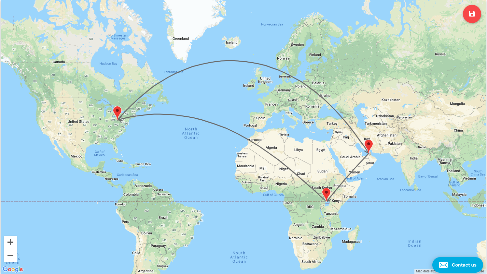
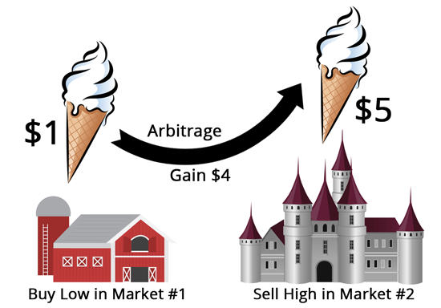
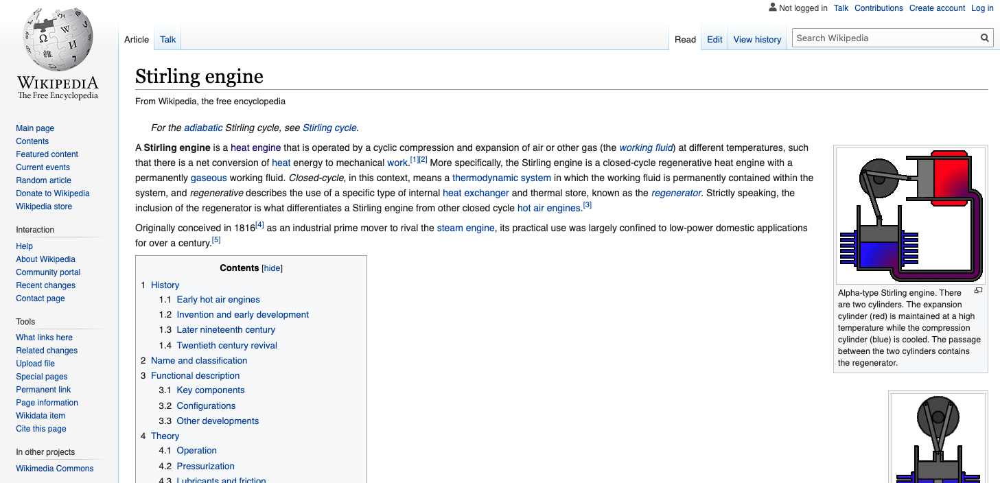
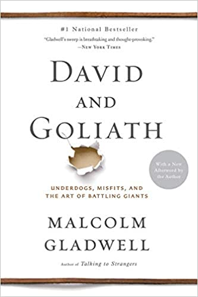
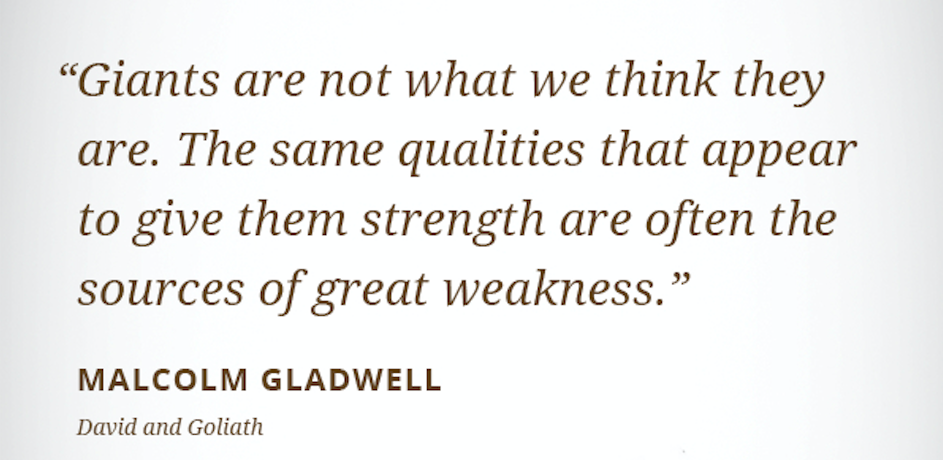
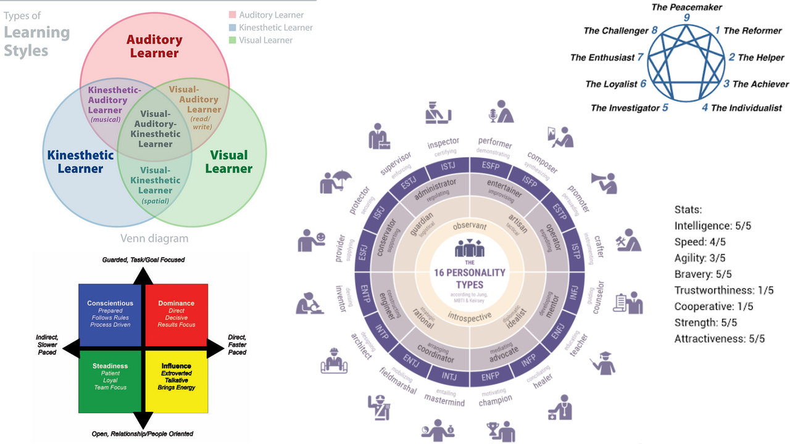

---


> Hacking Your Perspective

Welcome to the Singularity Hacker series. If you are joining us for first time, welcome! In this series we’ll explore ideas and cultural trends related to the internet and information technology. Today’s show is on Hacking Your Perspective

---



This story starts with an interesting conversation had with a software developer from Uganda. We came in contact through a mutual friend in Dubai and the next thing you know we were chatting away via teleconference.

---


At the beginning of the conversation this Ugandan developer was discouraged and unsure about the future of his career. He spoke fluent English and had serious coding ability but didn’t feel confident that he could make enough money in the local economy or compete in the global market of software engineers. By the end of our talk, a radical change in perspective had occurred.

---


Rather than counting himself among the pool of local low-cost engineers, he shifted to see them as his resource. He had already proven that he could build MVP products and win clients to those products. The only link left was to direct those achievable streams of income into scaling those products using the very local, low-cost engineering resources he was afraid to be counted among.

---

(image:
  file: 05.gif
  size: contain
  sync: match)

We were both amazed by the end of our talk. No facts had changed, but a completely different perspective had been achieved. Inefficiencies were identified about his circumstance that could then be taken advantage of, instead of lamented. A few things come to my mind when the above scenario played out. The first was arbitrage.

---


An arbitrage opportunity is present when there is the possibility to instantaneously buy something for a low price and sell it for a higher price.

---



All entrepreneurship can be boiled down to this. Take something of lower value and moving it into a context of higher value. The real challenge is in identifying those arbitrage opportunities. The second thing that came to my mind was the Stirling engine.

---



The stirling engine uses the temperature difference between its hot and cold end to convert thermal energy into mechanical energy. The greater the temperature difference between the hot and cold sources, the greater the thermal efficiency.

---


Simply stated, a Stirling engine is an engine driven by differences in temperature. By virtue of its makeup, simply placing a Stirling engine on a heat source will cause the motor to run. This thermal inefficiency or disequilibrium is captured and taken advantage of to perform work. You could almost say that the Stirling engine is doing arbitrage on thermodynamics to run itself. So what do these two things have in common?

---


It is this. It is not ubiquity, continuity, or unanimity that produces strength. It is the intelligent and creative redirection of dynamic forces and realities that produces value. 

---



In his book David and Goliath, Malcolm Gladwell examines notable historical people who had, what seemed to be, disadvantages but who turned those perceived disadvantages into strengths. Following this train of thought, a profound idea presents itself. What if everyone’s perceived disadvantages are, in fact, unique opportunities to become people we could not otherwise be? And what if characteristics we routinely think of as unmitigated strengths come with their own negative tradeoffs?

---



Or, to use Gladwell’s own words, Giants are not what we think they are. The same Qualities that appear to give them strength are often the sources of great weakness.

---



All of economics and engineering demonstrate this fundamental principle. That there is no free lunch. There are trade-offs to every perceived strength or weakness. This holds true for a person's makeup, history, knowledge, and current position in life. Herein lies the challenge and opportunity you face today. Identify the unique arbitrage opportunities present in your exact situation and, like a Stirling engine, use them to your advantage. The only question is whether or not we are seeing them. 

---


```md
* What unique resource do I have an abundance of right now?
* To whom or in what context would this resource be of greater value?
* What can be done to capitalize on this disequilibrium?
```

Ask yourself these three questions. What unique resource do I have an abundance of right now? To whom or in what context would this resource be of greater value? Lastly, ask. What can be done to capitalize on this disequilibrium? 

---


May this be a reminder to us all that we are the product of our choices, not merely victims of our circumstances. I hope you have found these ideas helpful.

---


> SingularityHacker.com
> @singularityhack

Thank you for watching this first episode of the Singularity Hacker video series. Visit singularity hacker dot com to stay up to date with the many cool ideas and topics that we’ll be covering in future episodes.

---
