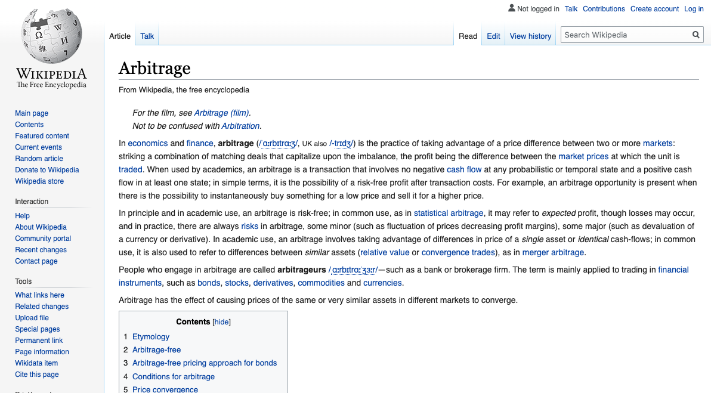

---

title: Hacking Your Perspective
tags: Content, Slides
slideOptions:
  center: true
# tags specific to hackmd but will casue error on narakeet build

# voice: Brian
# voice-speed: fast
# transition: crossfade
# global config tags specific to narakeet (causes no isses with hackmd)

---

<!-- intro stinger slide commented for lside mode -->
<!--  

--- 

-->

<!-- Images can't be referenced localy from github on hackmd so absolute urls must be used -->


<!-- Media must be local to be compiled to narakeet -->
<!--  -->

> Shown in video and blockquoted in slide mode
<!-- blockquote not shown in video generation -->

Note:
All normal text will be read in narakeet. Any text prefixed with "Note:" will be hidden behind speaker notes in hackmd slide mode.
Blockquotes are shown but not spoken in video generation. Might require an image to work properly. Things startign with > will be shown as block quotes in hackmd.

---

> Pure text test using only blockquote character. Compare to next slide for comparison.
<!-- blockquote not shown in video generation. also blank screen becaue no image but notes still read. -->

Note:
More speaker notes.

---

```
Very important purely text slide test. Difference between this and using the < character is that one shows as block quote and word wraps in slide mode.
```
<!-- looks like crap on video. takes up the whole screen. -->

Note:
This should be a pure textual slide in video compilation.

---


<!--  -->

```md
# Heading 1
## Heading 2

* bullets are left-aligned
* bullet 2
  * sub-bullet
```
<!-- renders directly over image in video but below it in slide mode. -->

Note:
This should render as narkdown in slide mode and video compilation.

---


<!--  -->

```css
.container {
  align-items: center;
  display: flex;
}
```
<!-- renders directly over image in video but below it in slide mode. -->

Note:
This is a CSS render test. I hope it works in both slide mode and video generation.

---


<!--  -->

```=
Should render with line numbers in hackmd.
Does it work?
We shall see.
```
<!-- renders directly over image in video but below it in slide mode. -->

Note:
This is a line number test. Does it work?

---


<!--  -->

```!
This should render with sofwrap in hackmd but it seems to not be working. Maybe the issue is happening because we are presetnign in slide mode.
```
<!-- renders directly over image in video but below it in slide mode. -->

Note:
This is an animated gif test and text softwrap test. The softwrap test doesnt seem to be working in slide mode and I think it may just be failing because its slide mode.

---


<!--  -->

Note:
Pure gif test with only speaker notes and no overlay text.
<!-- looks good -->

---

<!--  -->

> Sweet stinger video file goes here

Note:
This is where an outro video file would be appended.

---
